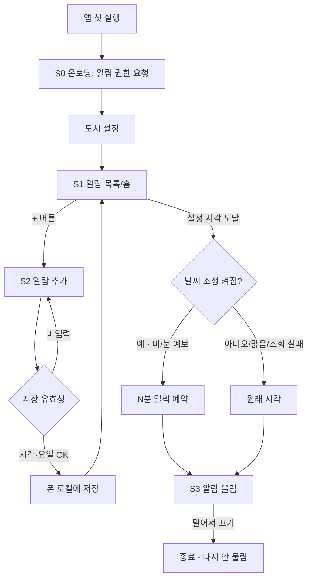

# 유저 플로우 — 스마트 알람 (가칭)

## 메인 플로우 (첫 실행 → 알람이 울려 끄기까지)

## 재방문 플로우
앱을 열면 바로 S1 목록. 온보딩은 없음(첫 실행 1회). 알람 추가·수정·삭제·켜고 끄기.

## 운영자 플로우
없음(MVP). 관리자 페이지 없음. 사용자 수는 필요 시 스토어/집계로 직접 확인.

## 상태 흐름
알람에는 켜짐/꺼짐 두 상태만. 진행 상태 머신은 없음(스누즈 없음이라 "울림→종료"가 끝).

## 화면 색인
| 화면 | 파일 | 목적 한 가지 |
|---|---|---|
| S0 온보딩 | screens/S0-온보딩.md | 알림 권한 + 도시 설정 |
| S1 목록/홈 | screens/S1-목록.md | 내 알람 보고 켜고 끄기 |
| S2 추가·편집 | screens/S2-추가편집.md | 알람 하나 만들기/고치기 |
| S3 알람 울림 | screens/S3-울림.md | 울릴 때 확실히 깨우기 |
