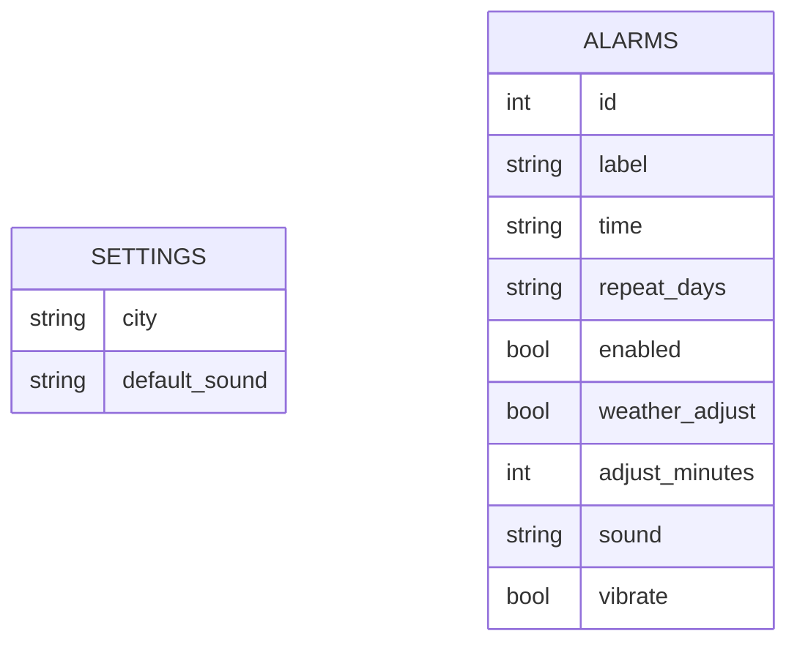

# DB 설계 — 스마트 알람 (가칭)

> 저장 위치: 폰 로컬(Expo SQLite 또는 AsyncStorage). MVP는 서버 DB(Supabase) 미사용.
> 로컬이라 "남의 데이터 열람 차단(RLS: 서버 창고 문 앞 출입 규칙)"은 해당 없음 — 내 폰 = 내 데이터.
> 기기 동기화가 필요한 다음 버전에서 이 구조를 그대로 Supabase 표로 옮기고 RLS를 붙인다.

## 표 목록
| 표 | 무엇 | 소유 | 규모 |
|---|---|---|---|
| alarms | 알람 하나하나 | 본인(폰) | 수십 개 |
| settings | 앱 설정(1줄) | 본인(폰) | 1건 |

## 관계 도식

관계 없음: settings는 전역 1줄, alarms와 연결(꼬리표) 없음.

## 표 상세: alarms
| 항목 | 종류 | 필수 | 중복금지 | 비고 |
|---|---|---|---|---|
| id | 번호(자동) | O | O | |
| label | 글자 | X | | 라벨(예: 출근 알람) |
| time | 글자(HH:MM) | O | | 울릴 시각 |
| repeat_days | 글자(요일 집합) | O | | 예: "1,2,3,4,5" (월~금). 하나 이상 |
| enabled | 예아니오 | O | | 기본 켜짐(true) |
| weather_adjust | 예아니오 | O | | 날씨 조정 켜짐 여부. 기본 false |
| adjust_minutes | 숫자 | 조건 | | weather_adjust=true일 때. 비/눈이면 이만큼 일찍. 기본 15 |
| sound | 글자 | X | | 알람음(없으면 설정 기본값) |
| vibrate | 예아니오 | O | | 기본 true |
| created_at / updated_at | 시각(자동) | O | | 기본 포함 |

## 표 상세: settings (1줄)
| 항목 | 종류 | 필수 | 비고 |
|---|---|---|---|
| city | 글자 | O | 날씨 조회용 도시명 |
| default_sound | 글자 | X | 기본 알람음 |

## 권한
- 로컬 저장이라 서버 RLS 없음. 다음 버전(서버 전환) 시: alarms/settings 모두 "본인만 읽기·쓰기·수정·삭제", 공개(anon) 수정·삭제 절대 금지.

## 삭제 정책
- 알람: 진짜 삭제(soft delete 아님). 개인 폰 데이터라 복구 요구 없음.

## 검색·정렬
- 검색: 없음. 정렬: 목록은 시간 오름차순(다음 울릴 순).

## 초기 데이터(시드)
- 없음. 빈 목록에서 시작. 도시는 온보딩에서 사용자가 설정.

## 저장 초안 (로컬 SQLite 예시)
```sql
create table alarms (
  id integer primary key autoincrement,
  label text,
  time text not null,            -- "06:45"
  repeat_days text not null,     -- "1,2,3,4,5"
  enabled integer not null default 1,
  weather_adjust integer not null default 0,
  adjust_minutes integer default 15,
  sound text,
  vibrate integer not null default 1,
  created_at text not null default (datetime('now')),
  updated_at text not null default (datetime('now'))
);
create table settings (
  id integer primary key check (id = 1),  -- 항상 1줄
  city text not null,
  default_sound text
);
```
(다음 버전에서 Supabase로 옮길 때: id는 uuid + user_id 꼬리표 추가, RLS 정책 부착. FOREIGN KEY 제약은 걸지 않는다.)
