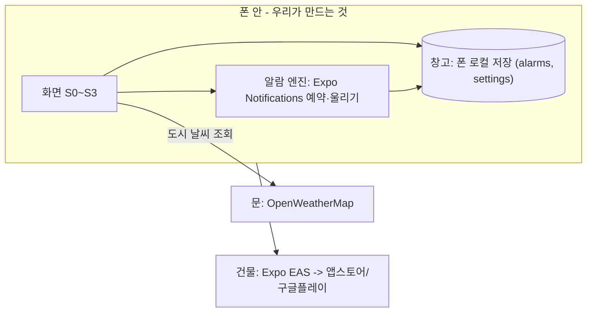

# 시스템 지도 — 스마트 알람 (가칭)
> 이 앱이 어떤 부품으로 되어 있고, 밖에서 뭘 빌려오는지 한 장.
> 비유: 화면(사용자가 보는 곳) · 알람 엔진(폰이 정해진 시각에 울려주는 장치) · 창고(폰 안 저장소) · 문(밖에서 빌리는 서비스) · 건물(배포).

## 한눈 도식

## 누가 들어오나 (역할 -> 공간)
| 역할 | 들어가는 공간 | 할 수 있는 일 |
|---|---|---|
| 사용자(본인) | 앱(S0~S3) | 알람 만들기·수정·삭제·켜고 끄기, 도시 설정 |
| 운영자(나) | (별도 화면 없음) | 사용자 수 등은 스토어에서 직접 확인 |
| 다음 버전 역할 | — | 로그인 사용자(기기 동기화) — 아래 "안 여는 문" |

## 빌려오는 것 (문 목록)
| 문(서비스) | 무엇을 대신해주나 | 어느 기능에 필요한가 | .env 키 | 과금 |
|---|---|---|---|---|
| OpenWeatherMap | 도시 날씨 예보 | 날씨 조정 | EXPO_PUBLIC_OPENWEATHER_API_KEY (apps/mobile/.env) | 무료 티어 |
| Expo Notifications | 정해진 시각 알림(폰 내장) | 알람 울리기 | (없음) | 무료 |

## 이번 스코프에서 안 여는 문
- Supabase(서버 DB·로그인) — 폰 로컬 저장으로 대체, 기기 동기화 다음 버전 → 06-decisions 참조.
- Vercel(웹 배포) — 모바일 앱이라 앱스토어/EAS 배포.
- 지도·GPS — 도시 직접 설정이라 불필요.
